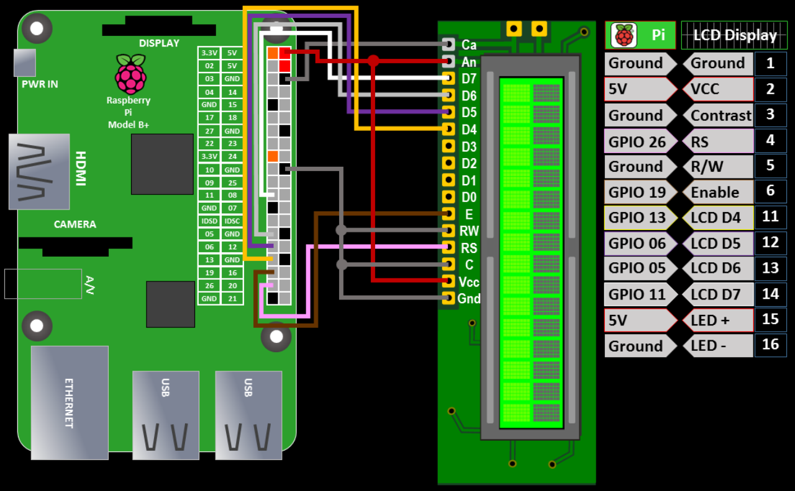

## Oxymeter Service on Raspberry Pi 4


## Description
The Oxymeter Service is a software application that reads measurment via btle protocol and monitors the bpm to LCD based on Pulse Oximeter J1.
Prototype made for Ice Bath personal performance monitoring. 

## Device link
https://www.aliexpress.com/item/1005003621450506.html?spm=a2g0o.order_list.order_list_main.156.2be918020vp5ll

### Features

- Autostarts the service even if the device disconnected few times
- Other readings can be read from the input string

### Handles example
1. Notification handle = 0x0028 value: 90 02 03 01 5f 40 0e ff 00 00 00 00 00 00 00 00 00 00 00 00 
2. Notification handle = 0x002e value: 90 02 04 01 04 2f 01 40 01 01 0e 02 01 40 7f 01 04 02 00 00 
- bpm = databytes[5]
- spo2 = databytes[4]
- hrv = databytes[6]
- pi = databytes[7]

### Usage

To use the Oxymeter Service, follow these steps:

```bash
$ pip install -r requirements.txt
$ sudo apt-get install python-pip libglib2.0-dev
$ sudo pip install bluepy
$ sudo pip install paho-mqtt
$ sudo pip install adafruit-circuitpython-charlcd
$ mv /home/toon/oxymeter_service/org_oxymeter.service /etc/systemd/system/oxymeter.service
$ sudo systemctl enable oxymeter.service
$ sudo systemctl daemon-reload
$ sudo reboot now
```


### Usefull commands
- sudo journalctl -u oxymeter.service
- sudo systemctl daemon-reload 
- sudo systemctl status oxymeter.service
- sudo systemctl restart oxymeter.service
- sudo nano /etc/systemd/system/oxymeter.service 

### Device image


### LCD scheme and explanations (Thanks!!!)
https://www.rototron.info/lcd-display-tutorial-for-raspberry-pi/


